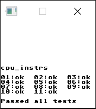
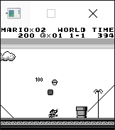
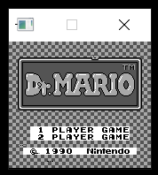
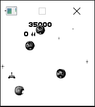
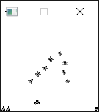
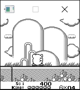

# GBEmu

GBEmu is a simple Nintendo Gameboy (DMG) emulator written in C++, using SDL for the GUI. It can boot a few ROM-only and MBC 1 games, albeit very slowly.

## Features
 - Passes all tests in blargg's cpu_instrs ROM
 - Nearly complete MBC 1 support
 - Incomplete sound support
 - CPU stepping and breakpoints
 - Nearly complete interrupt support, including timers
 - Compiles on both Windows and Linux (and presumably MacOS as well) using CMake

## Screenshots

## Unimplemented features/TO-DO
  - Finish sound support
  - HALT bug emulation
  - MBC 2 & 3 support
  - Savestates
  - Fast-forward/rewind
  - Cartridge battery RAM
  - Advanced debugging features such as memory dumping 

## Compatibility
| ROM                         | Compatibility notes                                                                                                                                                                                   |
|-----------------------------|-------------------------------------------------------------------------------------------------------------------------------------------------------------------------------------------------------|
| Asteroids                   | Can get in-game, but is very slow and the ship sprite can bug out at times                                                                                                                      |
| Asteroids & Missile Command | Crashes on boot when trying to select the upper bits of the ROM/RAM bank (upper bit selection is unimplemented). 
| Blargg's Test ROMs          | Passes all tests in the cpu_instrs ROM.
| Donkey Kong Land            | Title screen shows, and gets to a flickering menu after that.                                                                                                             |
| Dr. Mario                   | Boots to menus, but hangs when going in-game (probably due to incomplete timer support).                                                                                                              |
| Galaga & Galaxian           | Fully playable, but pretty slow.                                                                                                                                                                                     |
| Kirby's Dream Land          | Playable but very slow.			 |
| Super Mario Land            | Playable but slow.			 |
| Tetris                      | Playable but slow.                                                                                                                                    |
| Tetris 2                    | Same as the original Tetris.                                                                                                                                                                            |
 
