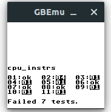
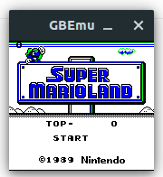

# GBEmu

GBEmu is a simple Nintendo Gameboy (DMG) emulator written in C++, using SDL for the GUI. It can boot a few ROM-only and MBC 1 games, albeit very slowly.

## Features
 - Nearly complete MBC 1 support
 - Partial GPU emulation
 - CPU stepping and breakpoints
 - Nearly complete interrupt support, including timers
 - Compiles on both Windows and Linux (and presumably MacOS as well) using CMake

## Screenshots

## Unimplemented features/TO-DO
  - Sound support
  - HALT bug emulation
  - MBC 2 & 3 support
  - Savestates
  - Fast-forward/rewind
  - Cartridge battery RAM
  - Advanced debugging features such as memory dumping 
