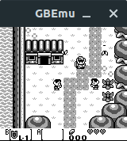
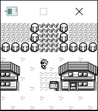

# GBEmu

GBEmu is a simple Nintendo Gameboy (DMG) emulator written in C++, using SDL for the GUI. It can run a large portion of the Game Boy library, including popular titles such as Pokemon and Kirby.

## Controls
 - Start: A
 - Select: S
 - A: Z
 - B: X
 - D-pad: Arrows
 - Save current cartridge RAM: P
 - Manually load cartridge RAM: L

## Features
 - Passes all tests in blargg's cpu_instrs test ROM
 - Nearly complete MBC 1 and 3 support
 - Complete (if buggy) sound support
 - CPU stepping and breakpoints
 - Nearly complete interrupt support, including timers
 - Compiles on both Windows and Linux (and presumably MacOS as well) using CMake

## Screenshots

## Unimplemented features/TO-DO
  - Fix sound bugs
  - HALT bug emulation
  - MBC 2 support
  - MBC 3 RTC support
  - Savestates
  - Fast-forward/rewind
  - Advanced debugging features such as memory dumping 

## Compatibility
| ROM                         | Compatibility notes                                                                                                                                                                                   |
|-----------------------------|-------------------------------------------------------------------------------------------------------------------------------------------------------------------------------------------------------|
| Asteroids                   | Fully playable, but the ship sprite occasionally bugs out.                                                                                                                     |
| Asteroids & Missile Command | Fully playable. 
| Blargg's Test ROMs          | Passes all tests in the cpu_instrs ROM.
| Donkey Kong Land            | Title screen shows, and gets to a flickering menu after that. Can get in-game, but video is messed up. I think the cartridge assumes it's running on a GBC.                                                                                                             |
| Dr. Mario                   | Boots to menus, but hangs when going in-game (probably due to incomplete timer support).                                                                                                              |
| Galaga & Galaxian           | Fully playable.                                                                                                                                                                                     |
| Kirby's Dream Land          | Playable, but sound is somewhat broken (wave channel is buggy.)			 |
| Pokemon Red				  | Fully playable, but sound is kinda buggy. |
| Super Mario Land            | Fully playable.			 |
| The Legend of Zelda: Link's Awakening| Fully playable. |
| Tetris                      | Fully playable.                                                                                                                                    |
| Tetris 2                    | Same as the original Tetris.                                                                                                                                                                            |
 ## Known Issues
  - Sprites that go off-screen at all disappear. This is most easily seen in Kirby's Dreamland, when you fly up to the top of the screen
  - Sound is buggy, and can sometime desync with the video. It is very dependent upon CPU speed. Faster systems will cause the sound to play faster and at a higher pitch. 
