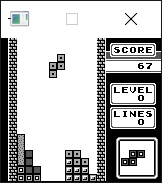

# GBEmu

GBEmu is a simple Nintendo Gameboy (DMG) emulator written in C++, using SDL for the GUI. It can boot a few ROM-only and MBC 1 games, albeit very slowly.

## Features
 - Passes all tests in blargg's cpu_instrs ROM
 - Nearly complete MBC 1 support
 - Incomplete sound support
 - CPU stepping and breakpoints
 - Nearly complete interrupt support, including timers
 - Compiles on both Windows and Linux (and presumably MacOS as well) using CMake

## Screenshots

## Unimplemented features/TO-DO
  - Finish sound support
  - HALT bug emulation
  - MBC 2 & 3 support
  - Savestates
  - Fast-forward/rewind
  - Cartridge battery RAM
  - Advanced debugging features such as memory dumping 

## Compatibility
| ROM                         | Compatibility notes                                                                                                                                                                                   |
|-----------------------------|-------------------------------------------------------------------------------------------------------------------------------------------------------------------------------------------------------|
| Asteroids                   | Fully playable, but the ship sprite occasionally bugs out.                                                                                                                     |
| Asteroids & Missile Command | Fully playable. 
| Blargg's Test ROMs          | Passes all tests in the cpu_instrs ROM.
| Donkey Kong Land            | Title screen shows, and gets to a flickering menu after that. Can get in-game, but video is messed up. I think the cartridge assumes it's running on a GBC.                                                                                                             |
| Dr. Mario                   | Boots to menus, but hangs when going in-game (probably due to incomplete timer support).                                                                                                              |
| Galaga & Galaxian           | Fully playable.                                                                                                                                                                                     |
| Kirby's Dream Land          | Playable, but sound is somewhat broken (wave channel is buggy.)			 |
| Super Mario Land            | Fully playable.			 |
| The Legend of Zelda: Link's Awakening| Fully playable. .|
| Tetris                      | Fully playable.                                                                                                                                    |
| Tetris 2                    | Same as the original Tetris.                                                                                                                                                                            |
 
